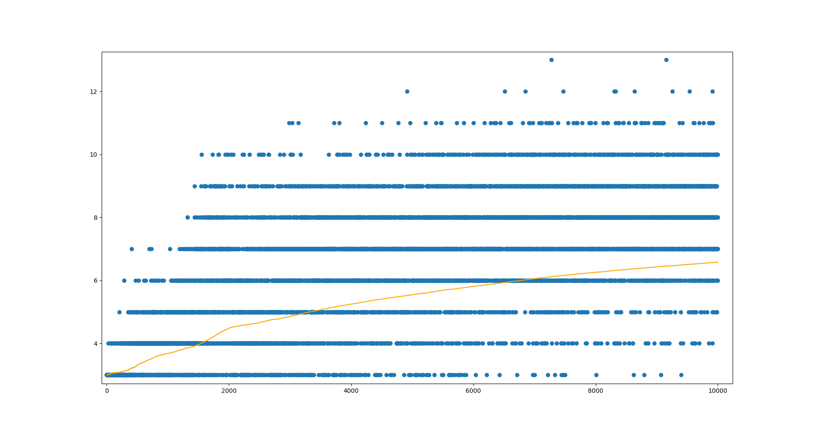

# snakeAI
### First attempt to use reinforcement learning to train neural network playing the snake game.

The main libraries used in this project were tensorflow and numpy. Most of the code was in fact taken from [this tutorial]:(https://adventuresinmachinelearning.com/reinforcement-learning-tensorflow/) that features a simpler game and adapted to snake.

Although I am certain better results can be achieved in this project taking a more scientific and/or knowledgeable approach to the problem, I'm satisfied with the observations I was able to make while experimenting with this solution, some of which are depicted below.

Length of the snake upon dying or after 50 moves (the orange line is the cumulative average of the legth)
